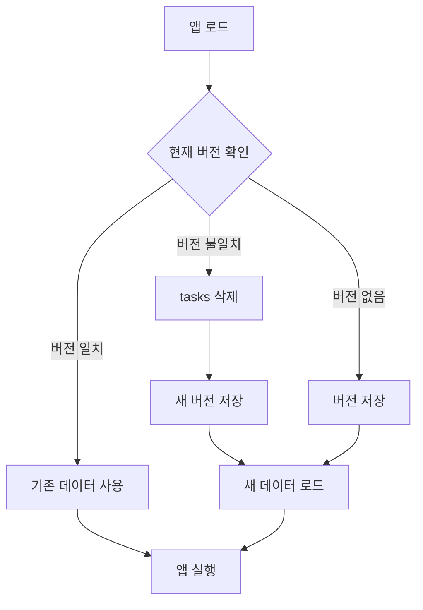

# LocalStorage 개발 가이드

이 문서는 프로젝트에서 LocalStorage를 사용하면서 발생한 문제점과 해결 방법을 정리합니다.

## 목차
- [개요](#개요)
- [발생한 문제들](#발생한-문제들)
- [해결 방법](#해결-방법)
- [데이터 버전 관리 시스템](#데이터-버전-관리-시스템)
- [개발 시 주의사항](#개발-시-주의사항)
- [디버깅 방법](#디버깅-방법)
- [FAQ](#faq)

---

## 개요

이 프로젝트는 사용자 데이터를 LocalStorage에 저장하여 관리합니다. LocalStorage는 브라우저에 데이터를 영구적으로 저장하는 기능으로, 다음과 같은 특징이 있습니다:

### LocalStorage의 특징
- ✅ **영구 저장**: 사용자가 명시적으로 삭제하지 않는 한 데이터가 유지됨
- ✅ **간편한 사용**: 별도의 백엔드 없이 클라이언트 측에서 데이터 관리 가능
- ❌ **초기화 문제**: 코드를 업데이트해도 기존 데이터가 남아있어 변경사항 미반영
- ❌ **데이터 구조 변경 어려움**: 스키마 변경 시 기존 데이터와 충돌 가능

---

## 발생한 문제들

### 1️⃣ 초기 데이터 변경이 반영되지 않는 문제

**문제 상황:**
```javascript
// DataContext.jsx에서 초기 데이터를 수정
const initialTasks = [
  { id: 1, name: '새로운 작업', ... }  // ← 코드 변경
];
```

그러나 브라우저에서는 여전히 **이전 데이터**가 표시됨.

**원인:**
```javascript
if (!localStorage.getItem('tasks')) {
  // 이 조건문은 이미 데이터가 있으면 실행되지 않음!
  localStorage.setItem('tasks', JSON.stringify(initialTasks));
}
```

LocalStorage에 이미 `tasks` 데이터가 존재하면 `if` 문이 실행되지 않아 새로운 초기 데이터가 로드되지 않습니다.

**영향:**
- 개발 중 데이터 구조 변경 시 매번 수동으로 LocalStorage를 삭제해야 함
- 프로덕션 환경에서 사용자들이 구 버전 데이터를 계속 사용
- 테스트 및 디버깅 어려움

---

### 2️⃣ 데이터 스키마 변경 시 호환성 문제

**문제 상황:**
작업(Task) 데이터 구조를 변경:

**변경 전:**
```javascript
{
  id: 1,
  name: '데이터베이스 설계',  // 자유 텍스트
  status: '요구정의'           // 작업 진행 단계
}
```

**변경 후:**
```javascript
{
  id: 1,
  name: '요구정의',           // 감리 유형 (제한된 값)
  status: '진행중'             // 작업 상태 (예정/진행중/완료 등)
}
```

**원인:**
- `name` 필드의 의미가 "작업 이름"에서 "감리 유형"으로 변경
- `status` 필드의 값이 "요구정의/설계/종료/진단"에서 "예정/계획/진행중/보류/완료"로 변경
- 기존 LocalStorage 데이터는 구 스키마 형식으로 저장되어 있음

**영향:**
- 화면에 잘못된 데이터 표시
- 드롭다운 선택 옵션과 실제 데이터 불일치
- 사용자 혼란 발생

---

### 3️⃣ 개발 중 반복적인 수동 작업 필요

**문제 상황:**
데이터를 수정할 때마다 다음 작업을 반복:

1. 개발자 도구(F12) 열기
2. Console 탭 이동
3. 다음 명령어 실행:
   ```javascript
   localStorage.removeItem('tasks');
   location.reload();
   ```
4. 변경사항 확인

**영향:**
- 개발 속도 저하
- 실수로 삭제하지 않고 테스트하여 버그 발견 지연
- 다른 개발자와 협업 시 혼란

---

### 4️⃣ 프로덕션 배포 시 사용자 데이터 문제

**문제 상황:**
새 버전을 배포해도 사용자들은 여전히 구 버전의 데이터를 사용:

- 사용자 A: 1개월 전에 처음 방문 → 구 버전 데이터 사용 중
- 사용자 B: 오늘 처음 방문 → 신 버전 데이터 사용
- 결과: 사용자마다 다른 화면을 보게 됨

**원인:**
배포된 코드는 업데이트되지만, 사용자 브라우저의 LocalStorage는 그대로 유지됨.

**영향:**
- 버그 리포트 시 재현 불가
- 사용자별로 다른 동작 발생
- 지원 및 유지보수 어려움

---

## 해결 방법

### ✅ 데이터 버전 관리 시스템 구현

#### 1. 버전 관리 로직 추가

**위치:** `src/context/DataContext.jsx`

```javascript
const initializeLocalStorage = () => {
  // 데이터 버전 관리 - 버전이 다르면 tasks를 재초기화
  const DATA_VERSION = '2.0'; // 감리 유형으로 변경된 버전
  const currentVersion = localStorage.getItem('dataVersion');

  if (currentVersion !== DATA_VERSION) {
    // 버전이 다르면 tasks를 삭제하여 재초기화되도록 함
    localStorage.removeItem('tasks');
    localStorage.setItem('dataVersion', DATA_VERSION);
  }

  // 이후 초기 데이터 로직...
};
```

#### 2. 동작 원리



#### 3. 버전 업데이트 시나리오

**시나리오 1: 처음 방문하는 사용자**
```
1. 앱 로드
2. localStorage.getItem('dataVersion') → null
3. 버전 '2.0' 저장
4. 새로운 초기 데이터 로드
```

**시나리오 2: 구 버전 사용 중인 사용자**
```
1. 앱 로드
2. localStorage.getItem('dataVersion') → '1.0' (또는 null)
3. currentVersion !== '2.0' 감지
4. localStorage.removeItem('tasks') 실행
5. 버전 '2.0' 저장
6. 새로운 초기 데이터 로드
```

**시나리오 3: 최신 버전 사용 중인 사용자**
```
1. 앱 로드
2. localStorage.getItem('dataVersion') → '2.0'
3. 버전 일치 확인
4. 기존 사용자 데이터 유지
```

---

## 데이터 버전 관리 시스템

### 버전 히스토리

| 버전 | 날짜 | 변경 내용 | 영향 받는 데이터 |
|------|------|-----------|-----------------|
| 1.0 | 2025-11-01 | 초기 버전 | - |
| 2.0 | 2025-12-03 | 작업 구조 변경: 감리 유형으로 전환 | tasks |

### 버전 업데이트 가이드

새로운 데이터 구조 변경이 필요한 경우:

#### Step 1: 버전 번호 증가
```javascript
const DATA_VERSION = '3.0'; // 2.0 → 3.0
```

#### Step 2: 삭제할 데이터 지정
```javascript
if (currentVersion !== DATA_VERSION) {
  // 필요한 데이터만 삭제
  localStorage.removeItem('tasks');
  localStorage.removeItem('projects'); // 추가로 삭제 필요 시
  localStorage.setItem('dataVersion', DATA_VERSION);
}
```

#### Step 3: 새로운 초기 데이터 정의
```javascript
const initialTasks = [
  // 새로운 스키마에 맞는 데이터
  { id: 1, name: '요구정의', type: 'audit', ... }
];
```

### 버전 관리 Best Practices

#### ✅ DO (권장사항)

1. **의미 있는 버전 번호 사용**
   ```javascript
   // Good
   const DATA_VERSION = '2.0'; // 주 버전 변경
   const DATA_VERSION = '2.1'; // 부 버전 변경

   // Bad
   const DATA_VERSION = 'latest';
   const DATA_VERSION = '1';
   ```

2. **변경 사유 주석 작성**
   ```javascript
   const DATA_VERSION = '2.0'; // 감리 유형으로 변경된 버전
   ```

3. **필요한 데이터만 삭제**
   ```javascript
   // Good - tasks만 영향받는 경우
   localStorage.removeItem('tasks');

   // Bad - 모든 데이터 삭제
   localStorage.clear();
   ```

4. **점진적 마이그레이션 고려**
   ```javascript
   if (currentVersion === '1.0') {
     // 1.0 → 2.0 마이그레이션
     migrateFrom1To2();
   } else if (currentVersion === '2.0') {
     // 2.0 → 3.0 마이그레이션
     migrateFrom2To3();
   }
   ```

#### ❌ DON'T (피해야 할 사항)

1. **버전 관리 없이 스키마 변경**
   ```javascript
   // Bad - 기존 사용자 데이터 깨짐
   const initialTasks = [
     { id: 1, newField: 'value' } // 새 필드 추가
   ];
   ```

2. **매번 localStorage.clear() 사용**
   ```javascript
   // Bad - 사용자의 모든 데이터 손실
   localStorage.clear();
   ```

3. **버전 번호 중복 사용**
   ```javascript
   // Bad - 이전 변경사항과 구분 불가
   const DATA_VERSION = '2.0'; // 이미 사용된 버전
   ```

---

## 개발 시 주의사항

### 1. 초기 데이터 수정 시

**작업 순서:**
1. `DATA_VERSION` 증가
2. 초기 데이터 수정
3. 필요한 경우 localStorage 키 삭제 로직 추가
4. 테스트

**예시:**
```javascript
// 1. 버전 증가
const DATA_VERSION = '2.1'; // 2.0 → 2.1

// 2. 초기 데이터 수정
const initialTasks = [
  { id: 1, name: '요구정의', newField: 'value' } // 새 필드 추가
];

// 3. 필요 시 추가 삭제
if (currentVersion !== DATA_VERSION) {
  localStorage.removeItem('tasks');
  localStorage.removeItem('relatedData'); // 관련 데이터도 삭제
  localStorage.setItem('dataVersion', DATA_VERSION);
}
```

### 2. 스키마 변경 시

**변경 타입별 대응:**

| 변경 타입 | 버전 변경 | 데이터 삭제 | 마이그레이션 |
|----------|----------|-----------|------------|
| 필드 추가 | 부 버전 | 선택적 | 불필요 |
| 필드 제거 | 부 버전 | 필수 | 불필요 |
| 필드 의미 변경 | 주 버전 | 필수 | 권장 |
| 데이터 타입 변경 | 주 버전 | 필수 | 필수 |

**예시:**

```javascript
// 필드 추가 (호환 가능)
// v2.0 → v2.1
const task = {
  id: 1,
  name: '요구정의',
  priority: 'high' // 새 필드 - 기존 데이터에 없어도 동작
};

// 필드 의미 변경 (호환 불가)
// v2.0 → v3.0
const task = {
  id: 1,
  name: '요구정의', // 이전: 작업 이름 → 현재: 감리 유형
  status: '진행중'   // 이전: 작업 단계 → 현재: 진행 상태
};
```

### 3. 테스트 방법

#### 로컬 개발 환경
```javascript
// Console에서 버전 확인
localStorage.getItem('dataVersion'); // "2.0"

// 특정 데이터 확인
JSON.parse(localStorage.getItem('tasks'));

// 강제로 구 버전 시뮬레이션
localStorage.setItem('dataVersion', '1.0');
location.reload(); // 마이그레이션 테스트

// 초기 상태로 리셋
localStorage.clear();
location.reload();
```

#### 프로덕션 배포 전 체크리스트
- [ ] 버전 번호가 증가했는가?
- [ ] 변경된 데이터 키가 삭제 로직에 포함되었는가?
- [ ] 새로운 초기 데이터가 올바른가?
- [ ] 기존 버전에서 마이그레이션 테스트를 완료했는가?
- [ ] 사용자 데이터 손실 가능성을 검토했는가?

---

## 디버깅 방법

### 브라우저 개발자 도구 활용

#### 1. LocalStorage 확인

**Chrome/Edge/Brave:**
1. `F12` → `Application` 탭
2. 좌측 `Storage` → `Local Storage`
3. 도메인 선택
4. 저장된 모든 키-값 확인 가능

**Firefox:**
1. `F12` → `Storage` 탭
2. `Local Storage` → 도메인 선택

#### 2. Console에서 직접 조작

**데이터 조회:**
```javascript
// 모든 키 확인
Object.keys(localStorage);

// 특정 데이터 확인
localStorage.getItem('dataVersion');
localStorage.getItem('tasks');

// 파싱하여 객체로 확인
JSON.parse(localStorage.getItem('tasks'));
```

**데이터 수정:**
```javascript
// 특정 키 삭제
localStorage.removeItem('tasks');

// 모든 데이터 삭제
localStorage.clear();

// 버전 수동 변경 (마이그레이션 테스트용)
localStorage.setItem('dataVersion', '1.0');

// 새로고침
location.reload();
```

**데이터 복사/백업:**
```javascript
// 현재 데이터 백업
const backup = {};
Object.keys(localStorage).forEach(key => {
  backup[key] = localStorage.getItem(key);
});
console.log(JSON.stringify(backup, null, 2));

// 복원
Object.keys(backup).forEach(key => {
  localStorage.setItem(key, backup[key]);
});
```

### 일반적인 문제 해결

#### 문제 1: 새 데이터가 로드되지 않음

**증상:**
```
코드를 수정했는데 화면에 이전 데이터가 표시됨
```

**해결:**
```javascript
// 1. 현재 버전 확인
localStorage.getItem('dataVersion'); // "1.0"

// 2. 강제 리셋
localStorage.clear();
location.reload();

// 3. 버전 확인
localStorage.getItem('dataVersion'); // "2.0"
```

#### 문제 2: 일부 데이터만 업데이트됨

**증상:**
```
tasks는 새 데이터인데 projects는 구 데이터
```

**원인:**
```javascript
// projects 삭제 로직이 누락됨
if (currentVersion !== DATA_VERSION) {
  localStorage.removeItem('tasks');
  // localStorage.removeItem('projects'); ← 누락!
}
```

**해결:**
```javascript
// 삭제 로직 추가
localStorage.removeItem('projects');
location.reload();
```

#### 문제 3: "진행 중" vs "진행중" 불일치

**증상:**
```
StatusBadge에서 스타일이 적용되지 않음
```

**원인:**
```javascript
// 데이터: "진행 중" (공백 있음)
{ status: '진행 중' }

// 매핑: "진행중" (공백 없음)
const statusClasses = {
  '진행중': 'status-progress'
};
```

**해결:**
```javascript
// 양쪽 다 지원
const statusClasses = {
  '진행중': 'status-progress',
  '진행 중': 'status-progress', // 공백 있는 버전도 추가
};
```

---

## FAQ

### Q1: LocalStorage를 사용하는 이유는?

**A:**
- 백엔드 서버 없이도 데이터 저장 가능
- 프로토타입/데모 앱에 적합
- 간단한 구현으로 빠른 개발 가능

**단점:**
- 사용자별로 데이터 격리 (다른 기기에서 접근 불가)
- 브라우저 캐시 삭제 시 데이터 손실
- 5-10MB 용량 제한

### Q2: 언제 버전을 올려야 하나?

**A:**
- **주 버전 (2.0 → 3.0)**: 스키마 변경, 필드 의미 변경
- **부 버전 (2.0 → 2.1)**: 필드 추가, 기본값 변경
- **패치 (2.0.1 → 2.0.2)**: 데이터 형식 수정, 버그 픽스

### Q3: 사용자 데이터를 보존하면서 업데이트하려면?

**A:** 마이그레이션 함수 작성:

```javascript
const migrateTasksFromV1ToV2 = () => {
  const oldTasks = JSON.parse(localStorage.getItem('tasks') || '[]');

  const newTasks = oldTasks.map(task => ({
    ...task,
    // 이전: name이 자유 텍스트
    // 새로운: name을 감리 유형으로 변환
    name: mapToAuditType(task.name),
    // 이전: status가 작업 단계
    // 새로운: status를 진행 상태로 변환
    status: mapToProgressStatus(task.status)
  }));

  localStorage.setItem('tasks', JSON.stringify(newTasks));
};

const mapToAuditType = (oldName) => {
  if (oldName.includes('요구')) return '요구정의';
  if (oldName.includes('설계')) return '설계';
  if (oldName.includes('완료') || oldName.includes('종료')) return '종료';
  return '요구정의'; // 기본값
};
```

### Q4: 프로덕션에서 사용자 데이터가 손실될 위험은?

**A:**
- **버전 관리 시스템 사용 시**: 안전 (의도한 데이터만 삭제)
- **localStorage.clear() 사용 시**: 위험 (모든 데이터 손실)

**권장 사항:**
```javascript
// Good - 특정 키만 삭제
localStorage.removeItem('tasks');

// Bad - 모든 데이터 삭제
localStorage.clear();
```

### Q5: 개발 중 매번 수동으로 삭제해야 하나?

**A:**
개발 환경에서는 자동 리셋 옵션 추가 가능:

```javascript
const initializeLocalStorage = () => {
  const DATA_VERSION = '2.0';

  // 개발 모드에서는 항상 리셋 (선택적)
  if (import.meta.env.DEV) {
    localStorage.removeItem('tasks');
  }

  // 프로덕션에서는 버전 관리
  const currentVersion = localStorage.getItem('dataVersion');
  if (currentVersion !== DATA_VERSION) {
    localStorage.removeItem('tasks');
    localStorage.setItem('dataVersion', DATA_VERSION);
  }
};
```

**주의:** 프로덕션 빌드에서는 제거!

### Q6: 다른 브라우저에서 다른 데이터가 보이는 이유는?

**A:**
LocalStorage는 브라우저별로 격리됩니다:
- Chrome의 LocalStorage ≠ Firefox의 LocalStorage
- 같은 브라우저라도 시크릿 모드는 별도 저장소

**해결:**
- 백엔드 DB 사용 (로그인 기능 필요)
- 또는 데이터 내보내기/가져오기 기능 추가

---

## 참고 자료

### 관련 파일
- `src/context/DataContext.jsx` - 데이터 관리 및 버전 관리 로직
- `src/pages/Tasks.jsx` - Task 페이지 (감리 유형)
- `src/components/StatusBadge.jsx` - 상태 배지 컴포넌트

### 외부 문서
- [MDN: Window.localStorage](https://developer.mozilla.org/ko/docs/Web/API/Window/localStorage)
- [Web Storage API](https://developer.mozilla.org/ko/docs/Web/API/Web_Storage_API)
- [LocalStorage 사용 시 주의사항](https://developer.mozilla.org/ko/docs/Web/API/Web_Storage_API/Using_the_Web_Storage_API)

---

**작성일:** 2025-12-03
**버전:** 1.0
**작성자:** Development Team
